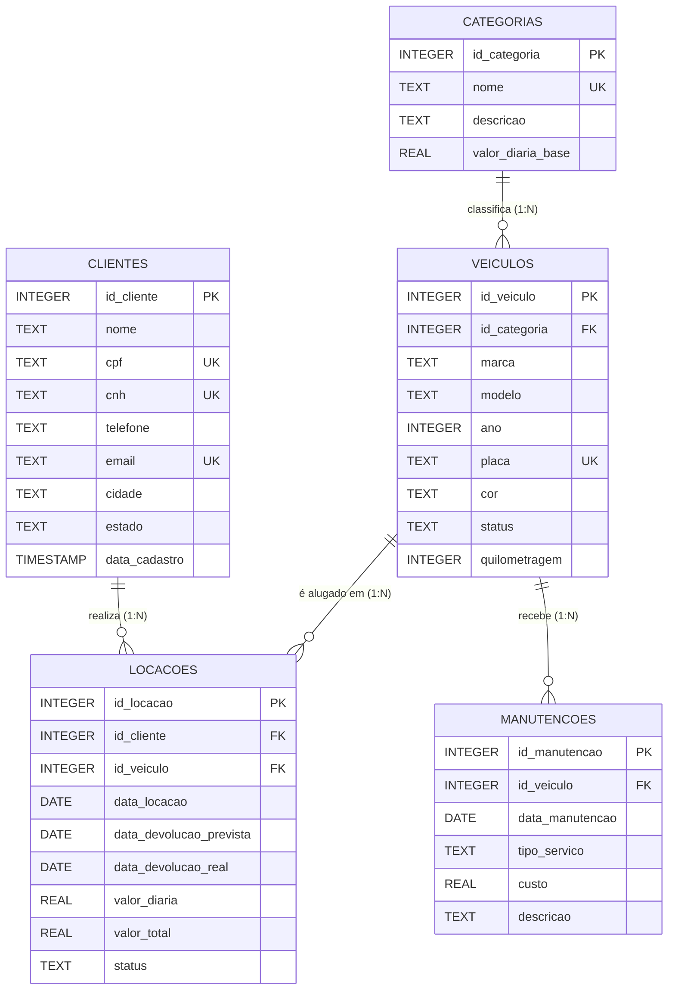

# 🚗 Locadora de Veículos Analytics

[](https://www.python.org/)
[](https://www.sqlite.org/)
[](https://docs.pytest.org/)
[](LICENSE)

Aplicação de terminal em Python integrada a banco de dados relacional **SQLite** para gerenciamento analítico e operacional de uma **Locadora de Veículos**, desenvolvida como solução completa para o **Desafio Engenharia de Dados JR**.

---

## 📌 Sumário
- [Visão Geral](#-visão-geral)
- [Estrutura do Projeto](#-estrutura-do-projeto)
- [Modelagem Relacional (SQL)](#-modelagem-relacional-sql)
- [Consultas Analíticas e Views](#-consultas-analíticas-e-views)
- [Arquitetura da Aplicação Python](#-arquitetura-da-aplicação-python)
- [Diferenciais e Bônus Implementados](#-diferenciais-e-bônus-implementados)
- [Como Configurar e Executar](#-como-configurar-e-executar)
- [Execução dos Testes Automatizados](#-execução-dos-testes-automatizados)
- [Histórico de Versionamento Git](#-histórico-de-versionamento-git)

---

## 🎯 Visão Geral

O projeto consolida as três competências centrais da trilha de Engenharia de Dados:
1. **Modelagem e Consultas Avançadas em SQL**: Criação de 5 tabelas relacionais com chaves primárias e estrangeiras, integridade referencial ativa, índices, views analíticas e agregações estatísticas (`SUM`, `AVG`, `COUNT`, `GROUP BY`, `HAVING`).
2. **Engenharia de Software em Python**: Modularização desacoplada, gerenciamento de contexto para transações ACID com SQLite, tratamento de exceções com `try/except` e interface CLI de alta legibilidade com formatação tabular.
3. **Qualidade e Versionamento**: Testes automatizados unitários e de integração com `pytest`, geração de gráficos analíticos com `matplotlib`, exportação para CSV e fluxo profissional de branches no Git.

---

## 📂 Estrutura do Projeto

```text
DesafioEngenhariaDadosJR/
├── .gitignore               # Configurações de exclusão (Python, SQLite, caches, venv)
├── README.md                # Documentação técnica e operacional completa
├── requirements.txt         # Dependências do projeto (pytest, matplotlib)
├── main.py                  # Ponto de entrada executável da aplicação CLI
├── sql/
│   ├── schema.sql           # DDL: Criação das 5 tabelas, constraints e índices
│   ├── seed.sql             # DML: Povoamento inicial com dados realistas
│   └── views.sql            # Views analíticas consolidadas
├── src/
│   ├── __init__.py
│   ├── database.py          # Gerenciamento de conexões, migrations e context manager
│   ├── reports.py           # Consultas analíticas SQL e renderizador de tabelas
│   ├── services.py          # Regras de negócio e cadastros (INSERT/UPDATE transacional)
│   ├── export.py            # Exportação de relatórios para CSV e gráficos com Matplotlib
│   └── menu.py              # Interface interativa de linha de comando (CLI)
├── tests/
│   ├── __init__.py
│   ├── test_database.py     # Testes de integridade de schema, chaves e constraints
│   ├── test_reports.py      # Testes de queries analíticas, views e formatação
│   └── test_services.py     # Testes de regras de negócio, reservas e devoluções
├── data/
│   └── locadora.db          # Arquivo do banco de dados SQLite (gerado na inicialização)
└── exports/                 # Diretório de saída para arquivos CSV e imagens PNG geradas
```

---

## 🗄️ Modelagem Relacional (SQL)

O banco de dados conta com **5 tabelas relacionais** estruturadas no arquivo `sql/schema.sql`:



### Detalhes das Tabelas:
1. **`clientes`**: Cadastro completo dos locatários com restrições de unicidade (`UNIQUE`) para CPF, CNH e E-mail.
2. **`categorias`**: Segmentação da frota (*Econômico, Sedã Compacto, SUV Urbano, Sedã Premium, Utilitário/Picape*) com valores de diária base.
3. **`veiculos`**: Frota disponível com vínculo à categoria (`FOREIGN KEY`), controle de status (`Disponivel`, `Alugado`, `Manutencao`) e quilometragem.
4. **`locacoes`**: Histórico e contratos ativos unindo cliente e veículo com cálculo de período e valor financeiro.
5. **`manutencoes`**: Histórico de manutenções preventivas e corretivas da frota com registro de custos para balanço operacional.

---

## 📊 Consultas Analíticas e Views

O projeto implementa consultas analíticas que atendem e superam todos os requisitos obrigatórios:

| Relatório / View | Cláusulas SQL Utilizadas | Objetivo Analítico |
| :--- | :--- | :--- |
| **`vw_faturamento_por_categoria`** | `LEFT JOIN`, `GROUP BY`, `SUM`, `COUNT`, `AVG`, `ROUND` | Consolida faturamento total, volume de locações, ticket médio e média de diárias por categoria. |
| **`vw_desempenho_clientes`** | `LEFT JOIN`, `GROUP BY`, `SUM`, `COUNT`, `AVG`, `MAX`, `ORDER BY` | Ranking de clientes por volume financeiro total, identificando os locatários mais frequentes e ticket médio. |
| **`vw_historico_locacoes_detalhado`** | Múltiplos `INNER JOIN` (4 tabelas), `JULIANDAY`, `ORDER BY` | Visão operacional completa com cliente, veículo, categoria, período e status. |
| **`vw_resultado_por_veiculo`** | `INNER JOIN`, `LEFT JOIN`, Subquery analítica, `SUM`, `ROUND` | Balanço operacional líquido por veículo: Receita gerada menos custos de manutenção preventiva/corretiva. |
| **Veículos Mais Alugados** | `INNER JOIN`, `LEFT JOIN`, `GROUP BY`, `HAVING`, `COUNT`, `ORDER BY` | Ranking de atratividade da frota filtrando apenas veículos com locações ativas ou finalizadas. |

---

## 🐍 Arquitetura da Aplicação Python

A aplicação foi construída com foco em boas práticas de engenharia de software:
- **`src/database.py`**: Garante a ativação de `PRAGMA foreign_keys = ON;` no SQLite, provê um context manager com controle automático de transação (`commit` / `rollback`) e função de migração/seed.
- **`src/reports.py`**: Camada de leitura desacoplada contendo as queries analíticas e o formatador de tabelas em ASCII para o terminal.
- **`src/services.py`**: Camada de regras de negócio contendo transações seguras (cadastro de clientes, veículos, realização de locação com baixa automática de status do veículo e rotina de devolução).
- **`src/export.py`**: Camada de integração que exporta datasets para `.csv` (com codificação UTF-8 BOM e delimitador `;`) e gera gráficos profissionais em `.png` via `matplotlib`.
- **`src/menu.py` / `main.py`**: Interface interativa em linha de comando (CLI) com validações contra dados incorretos e tratamento contínuo com `try/except`.

---

## ⭐ Diferenciais e Bônus Implementados

- [x] **Testes Automatizados**: Suíte com 15 testes unitários e de integração utilizando `pytest`.
- [x] **Ambiente Virtual**: Suporte nativo e documentado para `venv` com `requirements.txt`.
- [x] **Exportação de Dados**: Geração instantânea de qualquer relatório em formato **CSV**.
- [x] **Visualização de Dados (Matplotlib)**: Gráficos de barras de faturamento por categoria e comparação de receita vs custos salvos em alta resolução (`exports/`).
- [x] **Operações de Cadastro (INSERT/UPDATE)**: Criação interativa de clientes, veículos e registro de novas locações diretamente pelo terminal.

---

## 🚀 Como Configurar e Executar

### Pré-requisitos
- **Python 3.10** ou superior instalado na máquina.
- Gerenciador de pacotes `pip`.

### 1. Clonar o repositório
```bash
git clone https://github.com/BestWi11/DesafioEngenhariaDadosJR.git
cd DesafioEngenhariaDadosJR
```

### 2. Criar e ativar o ambiente virtual (`venv`)
- **No Linux / macOS:**
  ```bash
  python3 -m venv venv
  source venv/bin/activate
  ```
- **No Windows (PowerShell):**
  ```powershell
  python -m venv venv
  .\venv\Scripts\Activate.ps1
  ```

### 3. Instalar as dependências
```bash
pip install -r requirements.txt
```

### 4. Executar a aplicação
```bash
python main.py
```

Ao iniciar, a aplicação criará automaticamente o banco de dados `data/locadora.db` com o schema, views e dados iniciais de exemplo.

---

## 🧪 Execução dos Testes Automatizados

Para rodar a suíte completa de testes unitários e de integração:

```bash
python -m pytest -v
```

Saída esperada:
```text
============================= test session starts ==============================
collected 15 items

tests/test_database.py::test_init_db_creates_all_tables PASSED           [  6%]
tests/test_database.py::test_init_db_creates_views PASSED                [ 13%]
tests/test_database.py::test_foreign_key_constraint PASSED               [ 20%]
tests/test_database.py::test_unique_constraint_cpf PASSED                [ 26%]
tests/test_reports.py::test_get_faturamento_por_categoria PASSED         [ 33%]
tests/test_reports.py::test_get_ranking_clientes PASSED                  [ 40%]
tests/test_reports.py::test_get_veiculos_mais_alugados PASSED            [ 46%]
tests/test_reports.py::test_get_historico_locacoes PASSED                [ 53%]
tests/test_reports.py::test_get_resultado_operacional PASSED             [ 60%]
tests/test_reports.py::test_format_table_formatting PASSED               [ 66%]
tests/test_services.py::test_cadastrar_cliente PASSED                    [ 73%]
tests/test_services.py::test_cadastrar_veiculo PASSED                    [ 80%]
tests/test_services.py::test_registrar_e_finalizar_locacao PASSED        [ 86%]
tests/test_services.py::test_registrar_locacao_data_invalida PASSED      [ 93%]
tests/test_services.py::test_export_to_csv PASSED                        [100%]

============================== 15 passed in 0.22s ==============================
```

---

## 🌿 Histórico de Versionamento Git

O desenvolvimento seguiu o fluxo de branches recomendado no desafio:
- **`main`**: Branch estável de produção.
- **`feature/locadora-veiculos-analytics`**: Branch de trabalho onde foram implementados todos os módulos, scripts SQL e testes automatizados.

### Commits Semânticos:
1. `chore: initial project structure, gitignore and requirements`
2. `feat(database): add relational schema, seed data, and analytical views`
3. `feat(app): implement core database, reports, services, export and interactive cli menu`
4. `test: add automated test suites for database schema, views, reports and services`
5. `docs: add comprehensive README with architecture, ER diagram, queries and guide`
